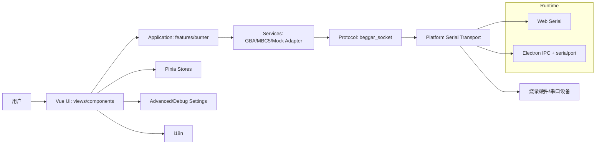

# 模块总览

## 范围与目标
- 范围：`web-client`（Vue3 + TypeScript + Vite + Electron）
- 目标：
  - 明确模块边界与职责
  - 固化关键数据流转路径
  - 对齐当前 guardrails/test 门禁
  - 为后续重构提供可执行基线

## 系统上下文



## 分层架构（当前实现）

```text
Presentation
  - src/views
  - src/components
  - src/composables
      |
Application
  - src/features/burner/application
      |
Domain/Rules（当前以 utils/types 分散承载）
  - src/utils/parsers
  - src/utils/progress
  - src/utils/rom
  - src/types
      |
Infrastructure
  - src/platform/serial
  - src/protocol/beggar_socket
  - src/services (adapter/device manager)
  - electron/*
```

说明：
- 项目已建立 `Application + Platform Serial + Protocol` 主干，但 `services` 仍承载部分编排/基础设施职责，属于过渡态。

## 依赖方向
- `Presentation -> Application -> Infrastructure`
- `services` 中适配器调用 `protocol`，`protocol` 调用 `platform/serial` 的 `Transport`
- UI 不允许直接 import `protocol/*`

## 依赖约束与质量门禁

### 依赖约束
- ESLint `import/no-restricted-paths`：
  - 禁止 `components/views -> protocol`
  - 禁止 `types/utils -> services`
  - 禁止 `protocol -> services/serial-service`
- 架构检查脚本：
  - `npm run check:deps`
  - 输出 top-level 依赖矩阵 + 违规边检查

### 测试门禁
- 主流程：`tests/burner-application.test.ts`
- 设备网关：`tests/device-gateway.test.ts`
- 传输契约：`tests/protocol-transport.test.ts`
- 规则工具：parser/progress/formatter/crc 等单测

推荐门禁命令：
- `npm run lint`
- `npm run type-check`
- `npm run test:run`
- `npm run check:deps`
- `npm run build`

## 当前差距与演进顺序

### 当前差距
- `CartBurner.vue` 仍较大，UI 与流程编排尚未完全解耦。
- `services` 同时承担“业务适配 + 基础设施”角色，边界仍可继续收敛。
- `serial-service.ts` 为兼容 facade，后续可逐步去存量依赖。

### 建议顺序
1. 继续拆分 `CartBurner`：将操作编排下沉到 `features/burner/application`。
2. 将 `services` 中可纯化逻辑下沉到 `domain/utils`，基础设施上移到 `platform/*`。
3. 用 `DeviceGateway + Transport` 作为唯一串口入口，逐步收敛 legacy API。
4. 每一步保持 `check:deps + tests` 绿灯后再推进。

## 文档维护规则
- 任何新增核心流程（连接、烧录、导出）需同步更新本目录对应数据流图文档。
- 任何新增跨层依赖规则需同步更新 `architecture-guardrails.md`。
- 每次大改后，至少运行一次：
  - `npm run check:deps`
  - `npm run test:run`
