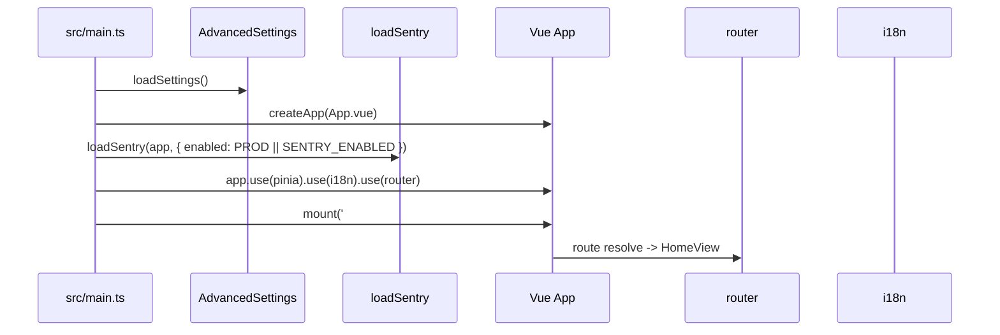
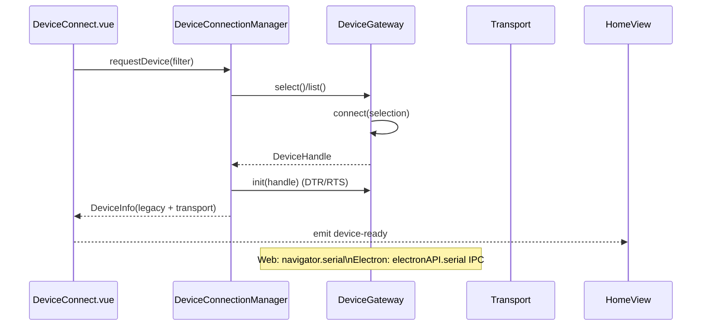
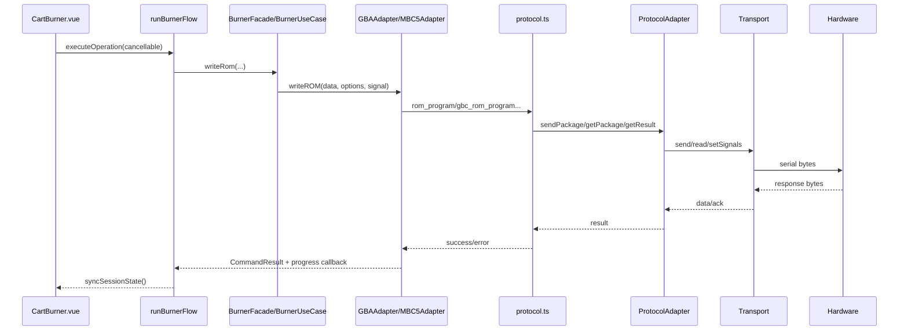
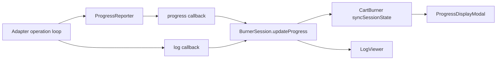
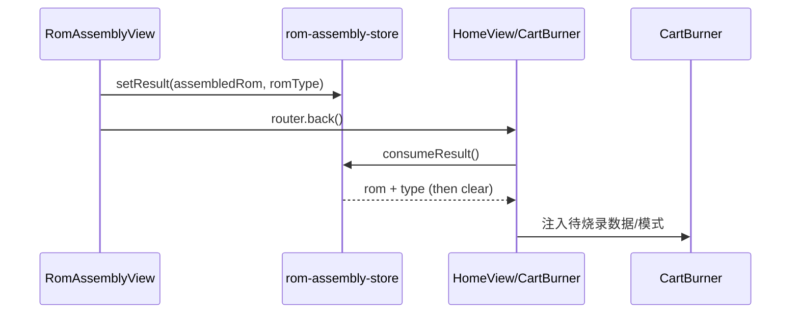
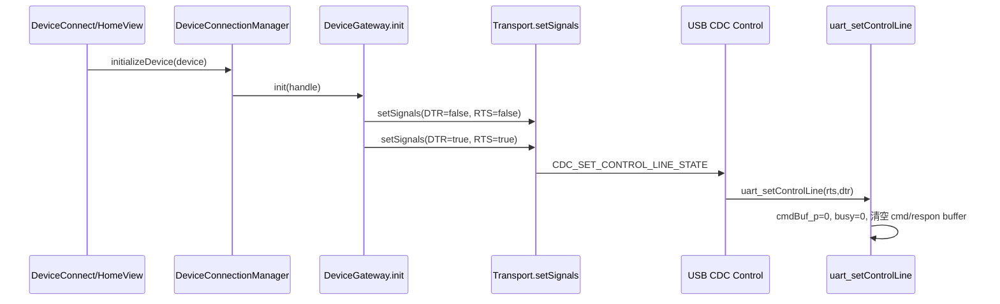
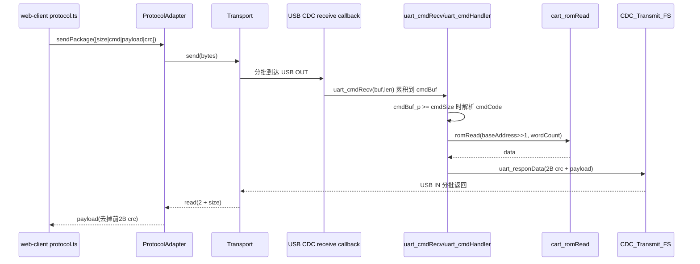

# 模块：关键数据流

## 1. 应用启动与初始化

## 2. 设备连接流（Web/Electron 统一入口）

## 3. 烧录操作主链路（以写 ROM 为例）

## 4. 进度与日志回传流

## 5. ROM 组装结果回流主页面

## 6. 控制线初始化与命令缓冲复位

## 7. 协议请求执行（以 ROM_READ 0xF6 为例）

## 8. 横切能力说明

| 能力 | 位置 | 说明 |
|------|------|------|
| 错误监控 | `src/utils/monitoring/sentry-loader.ts` | 生产环境或 `VITE_SENTRY_ENABLED=true` 时启用，捕获未处理异常，通过 `@sentry/vue` 上报 |
| 错误追踪 | `src/utils/monitoring/sentry-tracker.ts` | 手动上报接口，适配器/用例层可调用 |
| 进度计算 | `src/utils/progress/` | `ProgressReporter`、`ProgressBuilder`、`SpeedCalculator` 计算烧录速度与进度百分比 |
| 日志查看 | `src/utils/log-viewer.ts` | 统一日志格式化，`LogViewer.vue` 消费 |
| ROM 解析 | `src/utils/parsers/rom-parser.ts` | 解析 GBA/GBC ROM 头信息 |
| Flash 解析 | `src/utils/parsers/cfi-parser.ts` | 解析 CFI 查询结果，获取 Sector 分布 |
| 地址工具 | `src/utils/address-utils.ts` | 地址偏移计算 |
| CRC 工具 | `src/utils/crc-utils.ts` | CRC16 计算 |
| 压缩工具 | `src/utils/compression-utils.ts` | ROM 数据压缩/解压 |
| 端口过滤 | `src/utils/port-filter.ts` | `PortFilters.device(0x0483, 0x0721)` 过滤 STM32 设备 |
| 格式化 | `src/utils/formatter-utils.ts` | `formatHex()` 等十六进制格式化 |
| ROM 编辑 | `src/utils/rom/rom-editor.ts` | ROM 内容修改、补丁写入 |
| ROM 组装 | `src/utils/rom/rom-assembly-utils.ts` | 多 ROM 合并组装 |
| 错误类型 | `src/utils/errors/` | `NotImplementedError`、`PortSelectionRequiredError` |
